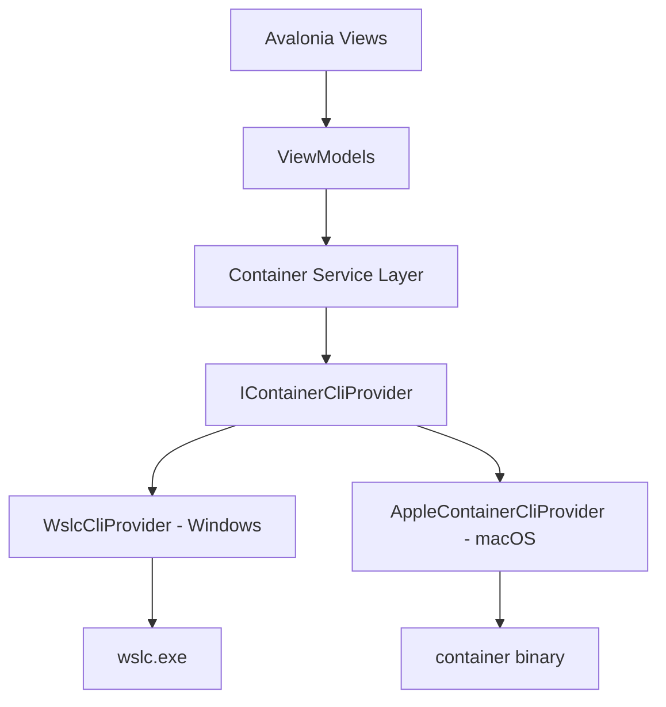

# Product Requirements Document — Knarr

| Field | Value |
|---|---|
| **Product name** | Knarr |
| **Type** | Cross-platform desktop application |
| **Platforms** | macOS (Apple Silicon + Intel), Windows 10/11 |
| **Tech stack** | .NET 10, Avalonia UI, MVVM |
| **Version** | 1.0 (Draft) |
| **Date** | 2026-07-14 |

---

## 1. Overview

Both Apple and Microsoft have shipped first-party, terminal-only containerization platforms:

- **macOS** — `container` (Apple Container), an Apple-native container runtime driven entirely by the `container` CLI.
- **Windows** — `wslc` (Windows Subsystem for Linux Container CLI), which manages WSL-backed Linux containers from the command line.

Both are powerful but CLI-only, creating a friction barrier for developers who prefer a graphical workflow (à la Docker Desktop / Podman Desktop). **Knarr** is a single desktop application that provides a unified, native GUI over both platforms — detecting the host OS and transparently delegating to the correct CLI (`container` on macOS, `wslc` on Windows).

Knarr is **not** a new runtime. It is a thin, reliable, well-tested GUI orchestration layer over the vendor CLIs.

## 2. Goals & Non-Goals

### Goals
- Provide one GUI experience for containers, images, networks, volumes, and registries on both platforms.
- Map GUI actions 1:1 onto the underlying CLI commands so behavior is predictable and auditable.
- Show the exact CLI command executed for every action (transparency + learning).
- Deliver a responsive, native-feeling UI using Avalonia + MVVM.
- Abstract platform differences behind a common command-provider interface.

### Non-Goals
- Reimplementing container runtime logic or bypassing the vendor CLIs.
- Supporting Linux Docker/Podman directly in v1 (may be considered later).
- Remote / cluster orchestration (Kubernetes, Swarm) in v1.
- Bundling or installing the CLIs themselves (Knarr detects and guides, but the user installs the platform).

## 3. Target Users

- Developers on macOS using Apple Container who want a visual dashboard.
- Developers on Windows using WSLC who want a Docker-Desktop-like experience.
- Teams standardizing on first-party OS containerization tooling instead of third-party runtimes.

## 4. Platform Abstraction Model

Knarr's core is a **command-provider abstraction**. All UI/ViewModels talk to `IContainerCliProvider`; the concrete provider is selected at runtime based on OS.



- **Windows** → `WslcCliProvider` shells out to `wslc <command>`.
- **macOS** → `AppleContainerCliProvider` shells out to `container <command>`.
- Provider parses `--format json` output where available; falls back to table parsing otherwise.
- Selection handled via DI at startup using `RuntimeInformation.IsOSPlatform`.

> **Implementation status:** `IContainerCliProvider` is implemented with `AppleContainerCliProvider`
> (macOS) and `WslcCliProvider` (Windows), selected by OS in `ServiceCollectionExtensions`. This
> first milestone covers **container** and **image** operations (list/start/stop/restart/kill/remove/inspect
> for containers; list/pull/push/tag/remove/prune/inspect for images). List output is requested as
> `--format json` and parsed with `System.Text.Json`. Networks, volumes and registries follow later.

### Command mapping (illustrative)

| Knarr action | Windows (`wslc`) | macOS (`container`) |
|---|---|---|
| List containers | `wslc list` | `container list` |
| Run container | `wslc run [opts] <image>` | `container run [opts] <image>` |
| Stop container | `wslc stop <id>` | `container stop <id>` |
| Remove container | `wslc remove <id>` | `container delete <id>` |
| List images | `wslc images` | `container image list` |
| Build image | `wslc build` | `container build` |
| Pull image | `wslc pull <image>` | `container image pull <image>` |
| Registry login | `wslc login` | `container registry login` |

> The Windows command surface below is authoritative per the `wslc` help output. macOS mappings follow the equivalent Apple Container verbs and are validated by the macOS provider.

## 5. WSLC Command Surface (authoritative — Windows)

Knarr must surface the following `wslc` capabilities.

### Top-level commands
`container`, `image`, `network`, `registry`, `settings`, `system`, `volume`, `attach`, `build`, `create`, `exec`, `export`, `images`, `import`, `inspect`, `kill`, `list`, `load`, `login`, `logout`, `logs`, `pull`, `push`, `remove`, `rmi`, `run`, `save`, `start`, `stats`, `stop`, `tag`, `version`.

### `wslc container` sub-commands
`attach`, `create`, `exec`, `export`, `inspect`, `kill`, `logs`, `list`, `prune`, `remove`, `run`, `start`, `stats`, `stop`.

### `wslc image` sub-commands
`build`, `remove`, `inspect`, `list`, `load`, `import`, `prune`, `pull`, `push`, `save`, `tag`.

### `wslc images` options
`-f/--filter`, `--format` (json|table, default table), `--no-trunc`, `-q/--quiet`, `--verbose`.

### `wslc run` options
`--cidfile`, `--cpus`, `-d/--detach`, `--dns`, `--dns-option`, `--dns-search`, `--domainname`, `--entrypoint`, `-e/--env`, `--env-file`, `--gpus`, `-h/--hostname`, `-i/--interactive`, `-l/--label`, `-m/--memory`, `--name`, `--network`, `--network-alias`, `-p/--publish`, `-P/--publish-all`, `--rm`, `--shm-size`, `--stop-signal`, `--tmpfs`, `-t/--tty`, `--ulimit`, `-u/--user`, `-v/--volume`, `-w/--workdir`.

### `wslc start` options
`-a/--attach`, `-i/--interactive`.

### `wslc stats` options
`-a/--all`, `--format` (json|table), `--no-trunc`. Accepts optional `container-id`.

### `wslc stop` options
`-s/--signal`, `-t/--time` (default 5). Accepts optional `container-id`.

### `wslc remove` (aliases `delete`, `rm`) options
`-f/--force`. Requires `container-id`.

### `wslc rmi` options
`-f/--force`, `--no-prune`. Requires `image`.

### Registry commands
`login`, `logout` (and `wslc registry` for credential management).

### Other
`settings` (opens settings file in default editor), `system` (system-level commands), `version`.

## 6. Functional Requirements

### 6.1 Dashboard / Home
- FR-1: On launch, detect OS and available CLI. If CLI not found, show setup guidance (install link, PATH check).
- FR-2: Display CLI version via `version` and Knarr's own version.
- FR-3: Health indicator for backend (WSL running / Apple Container service running).

### 6.2 Containers
- FR-4: List all containers with state, image, name, ports, uptime (`list`, refreshable, auto-poll interval configurable).
- FR-5: Container detail pane via `inspect` (JSON viewer + parsed fields).
- FR-6: Lifecycle actions: `start`, `stop` (with signal/time), `kill`, `restart`, `remove` (force toggle), `pause` where supported.
- FR-7: **Run wizard** exposing all `run` options (image, name, ports `-p`, env `-e`/`--env-file`, volumes `-v`, cpus/memory limits, network, detach, tty/interactive, entrypoint, workdir, labels, gpus, rm, restart/stop-signal, ulimits).
- FR-8: **Create** container without running (`create`).
- FR-9: **Logs** viewer (`logs`) with follow/tail, search, and copy.
- FR-10: **Exec** into container — open an integrated terminal (`exec`, with `-i`/`-t`).
- FR-11: **Attach** to a running container (`attach`).
- FR-12: **Export** a container filesystem to tar (`export`).
- FR-13: **Stats** live view (`stats`, json format) — CPU, memory, net I/O, block I/O, PIDs, with sparkline charts.
- FR-14: **Prune** stopped containers (`container prune`) with confirmation.

### 6.3 Images
- FR-15: List images with repo, tag, ID, size, created (`images`/`image list`, format json, `--no-trunc`, filter, quiet).
- FR-16: Image detail via `inspect`.
- FR-17: **Build** from Dockerfile with a build dialog (context dir, Dockerfile path, tags, build args) (`build`).
- FR-18: **Pull** with progress (`pull`); **Push** to registry (`push`).
- FR-19: **Tag** an image (`tag`).
- FR-20: **Remove** image (`rmi` / `image remove`) with force + no-prune options.
- FR-21: **Load** (`load`) / **Save** (`save`) / **Import** (`import`) image archives with file pickers.
- FR-22: **Prune** unused images (`image prune`).

### 6.4 Networks
- FR-23: List / inspect / create / remove networks via `network` sub-commands.
- FR-24: Show container-to-network attachments.

### 6.5 Volumes
- FR-25: List / inspect / create / remove volumes via `volume` sub-commands.
- FR-26: Show volume usage and mount points.

### 6.6 Registries
- FR-27: **Login** / **Logout** to registries (`login`/`logout`, `registry`), with secure credential handling (OS keychain / Windows Credential Manager — never plaintext).
- FR-28: Manage stored registry credentials.

### 6.7 System & Settings
- FR-29: Open platform settings (`settings`) and expose `system` commands.
- FR-30: Knarr preferences: theme (light/dark/system), auto-refresh interval, default registry, confirmation prompts, telemetry opt-in/out.

### 6.8 Command transparency
- FR-31: Every GUI action displays the exact CLI command being run and its raw stdout/stderr in an expandable "Command output" panel.
- FR-32: A "Copy command" button for each action.

## 7. Non-Functional Requirements

- NFR-1 (Performance): List views render < 500 ms for up to 500 containers/images; long CLI calls run async without blocking UI.
- NFR-2 (Architecture): Strict MVVM — Views have no code-behind logic beyond wiring; ViewModels are unit-testable and CLI-provider-agnostic.
- NFR-3 (Portability): Single codebase; only the CLI provider layer is platform-specific. Guarded by `RuntimeInformation` checks.
- NFR-4 (Security): No shell string concatenation of untrusted input — use argument arrays passed to `ProcessStartInfo`; validate/escape all user-supplied values (OWASP injection). Credentials stored in OS secure store.
- NFR-5 (Reliability): All CLI invocations have timeouts, cancellation support, and structured error surfacing.
- NFR-6 (Accessibility): Keyboard navigation, screen-reader labels, adequate contrast.
- NFR-7 (Observability): Optional local log file of executed commands (no secrets) for troubleshooting.
- NFR-8 (Packaging): macOS `.app`/`.dmg` (notarized) and Windows MSIX/installer.

## 8. Architecture

- **UI**: Avalonia 11, Fluent theme, compiled bindings.
- **Pattern**: MVVM (e.g., CommunityToolkit.Mvvm for `ObservableObject`/`RelayCommand`).
- **DI**: `Microsoft.Extensions.DependencyInjection` — provider selection at composition root.
- **Process execution**: A `CliRunner` wrapping `System.Diagnostics.Process` with async stdout/stderr streaming, cancellation, and argument-array safety.
- **Serialization**: `System.Text.Json` for `--format json` output.

### Suggested project layout
```
Knarr.sln
├── Knarr.App            # Avalonia views, styles, App bootstrap
├── Knarr.ViewModels     # MVVM view models (platform-agnostic)
├── Knarr.Core           # Models, IContainerCliProvider, CliRunner, services
├── Knarr.Platform.Wslc  # WslcCliProvider (Windows)
├── Knarr.Platform.Apple # AppleContainerCliProvider (macOS)
└── Knarr.Tests          # Unit tests (providers mocked)
```

## 9. Key User Flows

1. **First launch** → detect OS/CLI → if missing, show guided setup → else load dashboard.
2. **Run a container** → Images tab → select image → "Run" → wizard (ports/env/volumes/limits) → Knarr builds `run` args → executes → shows command + streams logs.
3. **Inspect running container** → Containers tab → select → detail pane (inspect JSON, live stats, logs, exec terminal).
4. **Build & push** → Images → Build (Dockerfile + tags) → Pull/Push to registry after `login`.

## 10. Success Metrics

- Time-to-first-container (fresh install → running container) < 3 minutes.
- ≥ 90% of documented `wslc`/`container` verbs reachable from the GUI.
- Zero credential leaks (verified by security review).
- Crash-free session rate ≥ 99.5%.

## 11. Assumptions & Dependencies

- The vendor CLI (`wslc` on Windows, `container` on macOS) is installed and on `PATH`.
- On Windows, WSL is installed and the container backend is available.
- CLI output formats (json/table) remain stable; Knarr version-checks and degrades gracefully.

## 12. Risks

| Risk | Impact | Mitigation |
|---|---|---|
| CLI output format changes | Parsing breaks | Prefer json format; version detection; resilient parsers |
| Command-verb divergence between platforms | Feature gaps | Abstract via provider; capability flags per platform |
| Command injection via user input | Security | Argument arrays, validation, no shell interpolation |
| CLI not installed / backend down | Broken UX | Detection + guided setup + health checks |

## 13. Out of Scope (v1) / Future

- Linux support (Docker/Podman providers).
- Docker Compose–style multi-container definitions.
- Remote hosts / Kubernetes.
- Image vulnerability scanning integration.
