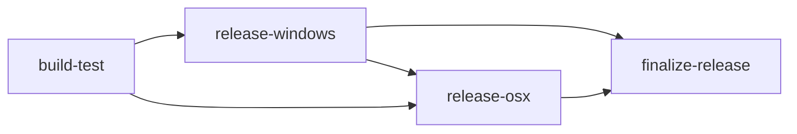

# Publishing Knarr

Knarr ships as a self-contained desktop app for Windows and macOS, packaged and auto-updated
using [Velopack](https://velopack.io/). This doc explains how cross-platform Avalonia
publishing works in this repo, what the CD pipeline ([`.github/workflows/cd.yml`](../.github/workflows/cd.yml))
does, and how to reproduce it locally.

## Why folder-based `dotnet publish` (not single-file)

Avalonia apps bundle native libraries (Skia, HarfBuzzSharp, ANGLE on Windows, etc.) that are
extracted/loaded from disk at startup. `PublishSingleFile` either fails to locate these natives or
adds noticeable startup overhead extracting them to a temp directory on every launch. Velopack also
expects a plain folder of loose files (it diffs individual files between versions to build delta
updates) — a single bundled exe would defeat that. So the pipeline always publishes to a folder:

```sh
dotnet publish src/Knarr.App/Knarr.App.csproj -c Release -r <RID> --self-contained true -o publish/<RID>
```

Target RIDs used today:
- `win-x64` — Windows 10/11 64-bit
- `osx-arm64` — Apple Silicon macOS

(Not yet built, but the same pattern would extend to `linux-x64`, `win-arm64`, `osx-x64` if needed.)

## Velopack overview

Velopack takes the published output folder and produces:
- **Windows**: a `Setup.exe` installer (installs per-user, no admin required — this is the
  "windows per user" artifact) *and* a portable `.zip` (extract-and-run, no installer — the
  "windows portable" artifact), from one `vpk pack` invocation.
- **macOS**: a `.app` bundle inside an installer package.

The app must call `VelopackApp.Build().Run();` as the very first line of `Main` (see
[`Program.cs`](../src/Knarr.App/Program.cs)) — this lets Velopack intercept special
install/update/uninstall command-line invocations (e.g. to create shortcuts) before any other
app startup code runs.

`vpk` is a .NET global tool:

```sh
dotnet tool install --global vpk
```

### Packing locally

```sh
dotnet publish src/Knarr.App/Knarr.App.csproj -c Release -r win-x64 --self-contained true -p:Version=1.2.3 -o publish/win-x64
vpk pack --packId Knarr --packTitle Knarr --packAuthors "Knarr Contributors" \
  --packVersion 1.2.3 --packDir publish/win-x64 --mainExe Knarr.App.exe \
  --icon src/Knarr.App/Assets/knarr.ico --runtime win-x64 -o Releases/win-x64
```

Swap `win-x64`/`knarr.ico`/`Knarr.App.exe` for `osx-arm64`/`knarr.icns`/`Knarr.App` to pack the
macOS build (run on a Mac; `vpk` behaves differently per host OS).

## Versioning

The release version comes from the git tag that triggers the pipeline (`v1.2.3` → `1.2.3`),
passed as `-p:Version=` to `dotnet publish` and `--packVersion` to `vpk pack`. Push a tag matching
`v*.*.*` to trigger a release (see the CD pipeline below).

## Icons

| File | Platform | Status | Notes |
|---|---|---|---|
| `src/Knarr.App/Assets/knarr.ico` | Windows | exists, low-res | Currently a single 32×32 frame. Should be regenerated as a multi-resolution `.ico` (16/32/48/256 px) for crisp installer/taskbar/Explorer icons — e.g. `magick knarr-logo.png -define icon:auto-resize=256,48,32,16 knarr.ico`. |
| `src/Knarr.App/Assets/knarr.icns` | macOS | committed | Generated once from `knarr-logo.png` (PNG-based icon types `icp4`/`icp5`/`icp6`/`ic07`-`ic10`, 16–1024 px). Regenerate and re-commit whenever the source logo changes (e.g. with `iconutil` on a Mac, or any icns-writing tool). |
| `ApplicationIcon` in `Knarr.App.csproj` | Windows | wired to `knarr.ico` | Sets the icon embedded in `Knarr.App.exe` (taskbar, Explorer). |
| MSI banner (493×58) / logo (493×312) bitmaps | Windows | not built | Only needed if a machine-wide `--msi` bootstrapper is added later. |
| Installer splash image (`--splashImage`) | Windows | not built | Optional polish, out of scope for now. |

## Windows code signing (avoiding "Unknown Publisher")

Without any Authenticode signature, Windows shows **"Unknown Publisher"** in the SmartScreen
prompt and installer UI. The CD pipeline signs `Setup.exe` and the app binaries with a
**self-signed certificate generated fresh on every run** (`New-SelfSignedCertificate` +
`Export-PfxCertificate`, no secrets stored). This is enough to replace "Unknown Publisher" with
the certificate's subject name (`CN=Knarr`).

**Caveat:** a self-signed cert has no trust chain, so Windows SmartScreen's *reputation* warning
("Windows protected your PC") can still appear for new/uncommon installers regardless of
signature — that warning is defeated by either:
1. An **OV/EV code-signing certificate** from a public CA (builds SmartScreen reputation over
   time; EV gets instant reputation), signed via `--signParams "/f cert.pfx /p <pwd> ..."` with
   the cert stored as a GitHub secret, or
2. **Azure Trusted Signing** (`--azureTrustedSignFile`), Microsoft's lower-cost cloud signing
   service — recommended next step when the project is ready to invest in this.

Both are documented in [Velopack's Windows signing docs](https://docs.velopack.io/reference/cli/content/vpk-windows)
if/when the project upgrades from self-signed.

## macOS signing & notarization

The `osx-arm64` build currently ships **unsigned and unnotarized**. macOS Gatekeeper will refuse
to open it with an "Apple could not verify... is free of malware" prompt. Until the project has
an Apple Developer account to sign (`--signAppIdentity`) and notarize (`--notaryProfile`), users
need to bypass Gatekeeper once per install:

- Right-click (or Control-click) the app → **Open** → **Open** in the confirmation dialog, or
- `xattr -dr com.apple.quarantine /path/to/Knarr.app`

## CD pipeline (`.github/workflows/cd.yml`)

Triggered by pushing a tag matching `v*.*.*`. Job graph:



1. **build-test** — restores, builds, runs tests with `dotnet test --collect:"XPlat Code
   Coverage;Format=cobertura"`, merges the results with ReportGenerator into a Cobertura +
   HTML report, uploaded as a workflow artifact. A SonarCloud scan step block is present but
   **fully commented out** until a SonarCloud project + `SONAR_TOKEN` secret exist.
2. **release-windows** — publishes `win-x64`, generates the ephemeral signing cert, runs
   `vpk pack` (producing both the installer and portable zip), uploads a **draft** GitHub
   release via `vpk upload github --merge true`.
3. **release-osx** — publishes `osx-arm64`, runs `vpk pack` against the committed `knarr.icns`
   (unsigned), merges into the same draft release.
4. **finalize-release** — once both platform jobs succeed, publishes the draft release
   (`gh release edit --draft=false`) so it only becomes visible once every artifact is attached.

The existing [`ci.yml`](../.github/workflows/ci.yml) (lint/build/test on PRs) and
[`codeql.yml`](../.github/workflows/codeql.yml) are unaffected by this pipeline.
